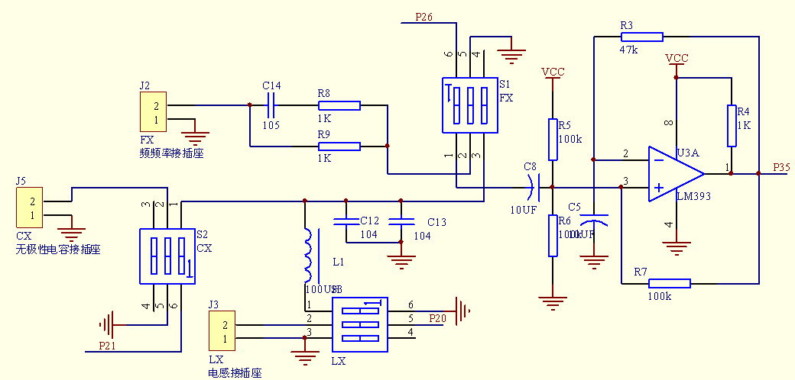
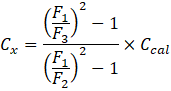
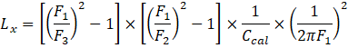
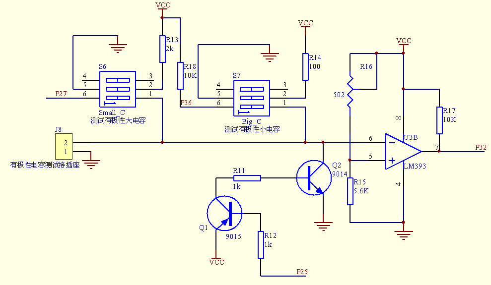
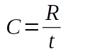
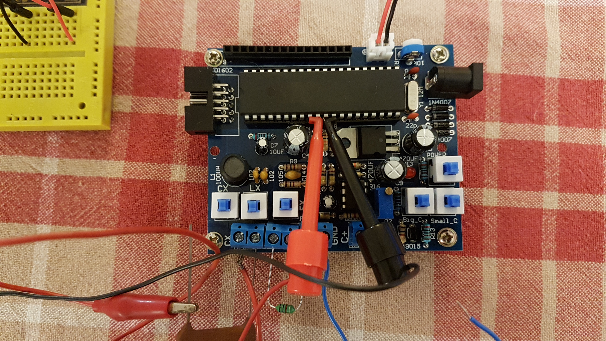
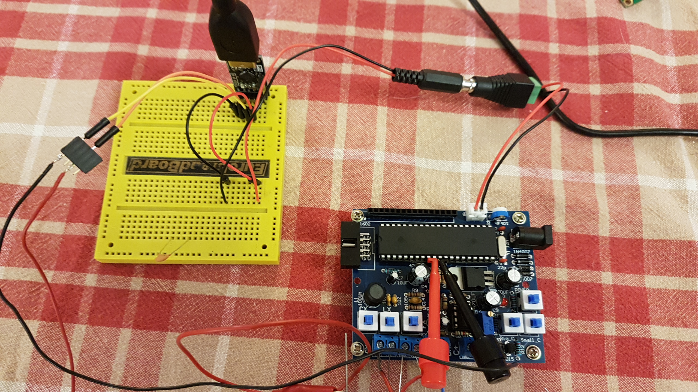
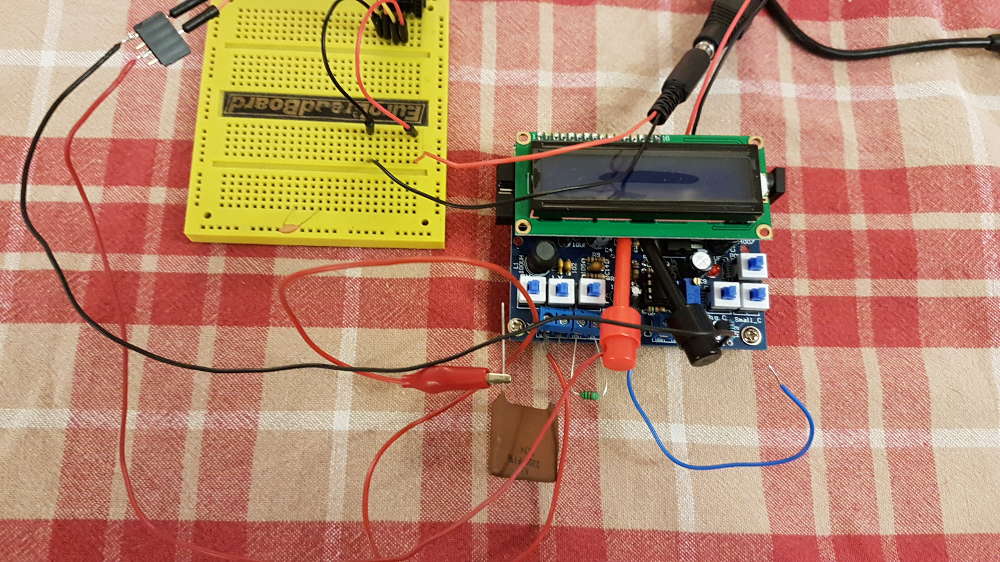

## Synopsis
An alternative improved firmware for the Ebay secohmmeter kit.
## Introduction
I saw [this kit for sale on Ebay](https://www.ebay.co.uk/itm/LED-Capacitance-Frequency-Inductance-Tester-Meter-51-microcontroller-DIY-Kit-A/291949314455?ssPageName=STRK:MEBIDX:IT&_trksid=p2057872.m2749.l2649) while looking for some way to measure inductors. My DMM can measure capacitance to about 3% accuracy but not inductance. Proper LCR meters are expensive and overkill for a hobbyist so I thought I'd give it a shot.
The kit arrived and I had an hour's fun soldering it together, powered it up and it worked first time!
Testing the frequency meter against the 1kHz signal from my oscilloscope showed it to be bang on. Other frequencies from my homebrew function generator were also accurate.
Testing some capacitors and inductors was a different story though. They were all in the right ballpark but not accurate enough to be useful.
I could find no way to calibrate the meter so I'm left with the option of reverse engineering it to see if I can add a way to calibrate it.
## How It Works
A quick search of the internet turned up a schematic and firmware source code which seemed to match my kit. I have added them here in a folder named *original*.
The schematic shows two seperate analog circuits: one for measuring L, C and frequency and another for measuring polarised capacitors (labelled Big_C and Small_C). It is the former I am most interested in.

## L C F Circuit
This is the circuit that measures non-polarised capacitors, inductors and frequency.
Here is the relevant part of the circuit:




L1, C12 & C13 form a tuned circuit which, along with U3A, form an oscillator. Pushbuttons are provided for inserting an unknown capacitor or inductor into the circuit which will alter the frequency of oscillation. The LM393 is a comparator which outputs logic 1 or 0 depending on which of its two inputs is largest giving us a square wave ouput at the oscillation frequency. To determine the frequency, all the microcontroller has to do is count the number of rising edges within a period of time.

A look at the firmware source code reveals that when the device starts up it waits a time for oscillation to settle and then it measures the base oscillation frequency storing this in variable f1. Then when you attach an unknown capacitor or inductor and press the appropriate button it measures the new oscillation frequency, applies some calculations and then displays the result on the LCD.
I think I see the problem: the calculation of unknown L and C uses the values of L1, C12 & C13 as parameters. But these are not accurate components. Given the cheapness of the kit I am guessing something like 10% or 20% tolerance. That's not really accurate enough but even though those components are not exactly the value they say they should be fixed at what they are. So if we can have some calibration value that takes this into account then we should be able to make it accurate enough. C12 & C13 are ceramic capacitors so their actual value will vary with temperature but I can easily replace those with something more stable.

This device appears to be a clone of [this original circuit](https://sites.google.com/site/vk3bhr/home/index2-html). Although many things have been changed (e.g. a different microcontroller), the principal of operation is identical.

The original circuit uses a relay to automatically switch in a known-value, accurate capacitor during its calibration phase. I don't want to modify the circuit board to add a relay but I can have the user insert a calibration capacitor into the unknown-C connection and press the button. The LCD can display the instructions. The MCU used has a section of Flash memory intended for self updating firmware. I don't need this feature but I can use the Flash as an EEPROM to store the calibration values so we don't need to calibrate every time we power it on.

Implementing this was fairly easy having found some [sample Flash code from the datasheet](http://www.stcmcu.com/datasheet/stc/SOURCE-CODE/STC89C58RD+%20FLASH-ISP-IAP.c). There is no way for the user to tell the firmware what value of calibration capacitor is used so I had to hardcode a value (I used 1nF) into the firmware; this can be changed to suit your capacitor by editing the source and recompiling. Two more changes were added: an acceptable delta between the stored F1 and the value measured at startup so that small differences do not force us into calibration mode and a startup key combo (CX and LX pressed at startup) to allow the user to erase the stored calibration values thus force re-calibration.

Now we have two calibration points to take into account when measuring unknown L or C. The resulting maths is a little more complicated and I was not able to implement accurately using the integer arithmetic used in the original firmware. Happily sdcc has a single-precision floating point library and we have enough program flash to accomodate it. Calculation speed isn't a problem for this application so I'm happy to stick with floating point maths.

In the following equations, the following symbols are used:

Symbol | Meaning
----- | -----
F1 | Oscillation frequency with no attached L or C
F2 | Oscillation frequency with calibration capacitor
F3 | Oscillation frequency with unknown capacitor or inductor
Ccal | Value of the calibration capacitor
Cx | Value of the unknown capacitor
Lx | value of the unknown inductor

Here is the equation to calculate unknown C:



Here is the equation to calculate unknown L:



## Big_C Small_C Circuit
This is the circuit that measures polarised capacitors. Here is the relevant part of the circuit:



Given the improvments achieved above perhaps I can improve the polarised capacitor measurement. Calibration would be tricky here as I have never heard of close tolerance electrolytic capacitors but the Big_C and Small_C report different values for the same capacitor.

Looking at the schematic we see that the circuit works by charging up the capacitor under test through a resistor. The capacitor positive is connected to the inverting input of the second comparator and the non-inverting comparator input is set to a fixed voltage using a resistor divider where one of the resistors is variable allowing some calibration of the threshold via the potentiometer. The capacitor is then discharged via Q2 and the charging starts again. The difference between Big_C and Small_C is that the former charges the capacitor via a 100 Ohm resistor and the latter uses a 2 kOhm resistor.

The firmware in this mode starts a timer once the capacitor has been discharged and sets an interrupt to fire when the comparator output goes low indicating the capacitor had charged up to the threshold set by the potentiometer. In this way the firmware knows how long the charging took and if the threshold is set to 63.2% of Vcc then we can calculate the capacitance using this formula:

Symbol | Meaning
----- | -----
R | Value of the resistor through with the capacitor is charged
t | Time taken to reach 63.2% threshold
C | Value of the unknown capacitor



Given that the value of the charging resistor is a factor in the calculation then again we are at the mercy of their tolerance but we should be able to allow for that in the setting of the variable resistor. What we can't allow for in this is the actual resistance ratio between the Big_C and Small_C resistors. But we can use a calibration to allow for this by measuring the same capacitor under both Big_C and Small_C modes and storing the calibration value in Flash as we did for the L/C/F circuit.
Having implemented this, there is still a difference between the Big_C and Small_C on the same capacitor. Things are improved but I'll stick to my DMM for measuring electrolytics unless I can improve this further. This device *will* measure larger capacitors than my DMM so there is some point to it.

## Building
The original source code used the Keil compiler. My firmware builds with [SDCC](http://sdcc.sourceforge.net/) because it's FOSS. It is packaged on many Linux distros. SDCC is also available for Windows but it works well under [WSL](https://en.wikipedia.org/wiki/Windows_Subsystem_for_Linux).
For Debian/Ubuntu (including under WSL):
```
sudo apt-get install make sdcc
make
```
For a debug build:
```
make DEBUG=1
```
If this succeeds you will have a file `secohmmeter.ihx` in the current folder. This is the file we need to flash to the device.

## Flashing
You might expect to use the programming header you soldered on to the circuit board but it turns out that this was for some other MCU. The STC chip we have here is programmed via its RxD and TxD pins. Unfortunately these pins are not connected anywhere on the circuit board.
I was able to attach some [hook probes](https://www.ebay.co.uk/itm/10pcs-Large-Size-Round-Single-Hook-Clip-Test-Probe-Lead-for-Electronic-Testing/321941689411?epid=25025056265&hash=item4af5385443:g:ZXUAAOSwwkRb9235:rk:10:pf:0) to the pins by removing the LCD and lifting the MCU chip slightly. I then attached them to a USB/Serial convertor. This also powers the circuit. Here are some photos:




The flashing software used is [stcgal](https://github.com/grigorig/stcgal). Follow the installation instructions on the site.

To flash the firmware:
```
stcgal -P stc89 -p /dev/ttyUSB0 secohmmeter.ihx
```

Where `/dev/ttyUSB0` is the serial port corresponding to my USB to Serial convertor - yours may be different.

This command is also in the makefile so (on Linux at least) you can:
```
make flash
```

stcgal will prompt you to power cycle the MCU. I do this by pulling the red jumper wire out of the breadboard and putting it back again. Don't power cycle the USB/Serial convertor!